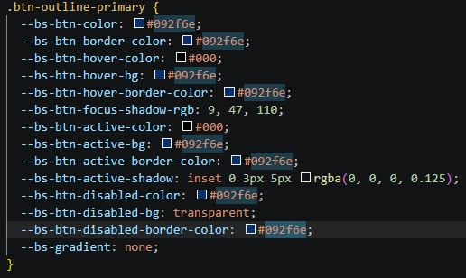

# Portafolio Web – Jordi Moises Alvarez Mora

Portafolio personal responsivo construido con **HTML, CSS, JavaScript y Bootstrap 5**, a partir de la plantilla *Resume* de Start Bootstrap.

**Sitio en vivo:** https://jordimoises01-pixel.github.io/Actividad-4/
**Repositorio:** https://github.com/jordimoises01-pixel/Actividad-4

## Descripción del proyecto
Este repositorio contiene el código fuente del portafolio web personal de Jordi Moises Alvarez Mora, estudiante de Ingeniería en Sistemas Computacionales en Oaxaca de Juárez. El sitio web presenta su perfil profesional, formación académica, proyectos actuales y planeados, habilidades técnicas e información de contacto.
- **Framework CSS:** Bootstrap 5.2.3 . 
- **Plantilla:** [Start Bootstrap – Resume](https://startbootstrap.com/theme/resume)

### Secciones del portafolio

| Sección | Descripción |
|---|---|
| Sobre mí | Presentación, datos de contacto, breve descripción y redes sociales. |
| Proyectos | Lista de proyectos realizados y planeados, con las tecnologías usadas y su estado. |
| Educación | Ingeniería en Sistemas Computacionales en el Instituto Tecnológico de Oaxaca (2022 - presente) y bachillerato tecnológico (CBTis 123). |
| Habilidades | Íconos de lenguajes/herramientas y forma de trabajo. |
| Intereses | Pasatiempos y temas de interés. |
| Contacto | Correo y enlace a GitHub. |

## Estructura del repositorio

```
├── index.html
├── README.md
├── css/portafolio.css
├── js/portafolio.js
├── img/        (foto de perfil y favicon)
└── capturas/   (capturas para este README)
```

## Proceso de creación

1. **Descarga de la plantilla** desde el repositorio oficial de Start Bootstrap.

2. **Organización de archivos:** renombré `styles.css` a `css/portafolio.css` y `scripts.js` a `js/portafolio.js`, y actualicé las rutas en `index.html`.

3. **Traducción al español** del contenido y de los menús, y cambio de `lang="en"` a `lang="es"`.

4. **Datos personales:** reemplacé nombre, contacto, descripción, educación e intereses por los míos.

5. **Foto de perfil:** sustituí la imagen de la plantilla por mi foto profesional en `img/perfil.jpg`.

6. **Nueva sección de Proyectos:** la plantilla no la incluye; la agregué reutilizando el formato de las secciones Experiencia y Educación (título, subtítulo, descripción y estado a la derecha).

7. **Habilidades:** ajusté los íconos de Font Awesome a las tecnologías que uso o estoy aprendiendo.

8. **Sección de Contacto:** agregada al final y al menú de navegación.

9. **Color principal:** cambié el naranja de la plantilla (`#bd5d38`) por azul `#092f6e` en las variables de color de `portafolio.css`.

10. **Resultado final:** con todos los cambios anteriores este es el resultado final


## Créditos

Plantilla: [Start Bootstrap – Resume](https://startbootstrap.com/theme/resume) (licencia MIT).
